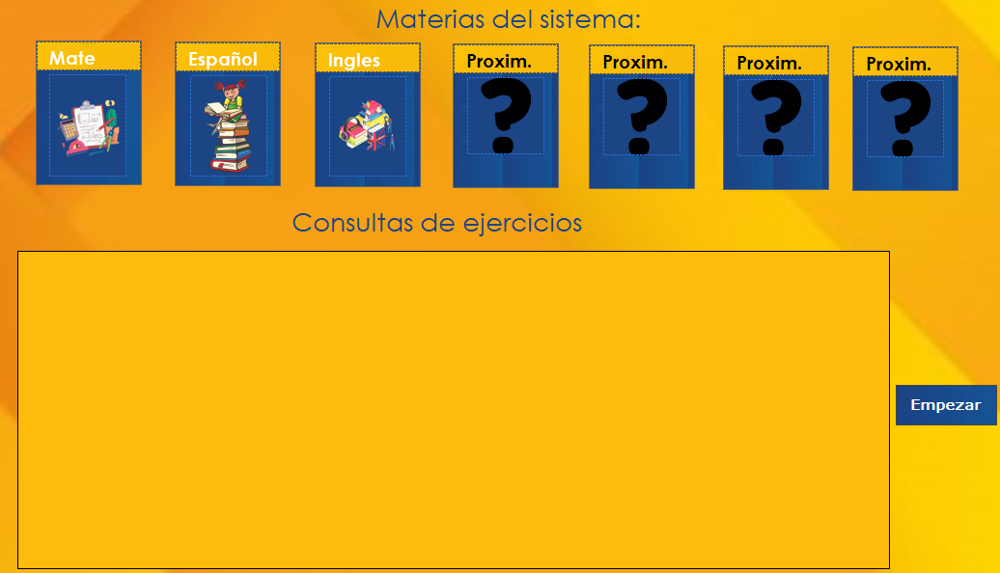

# 🧮 ProyectoLI - Acade

Este proyecto es una aplicación diseñada para gestionar cursos y el historial académico de estudiantes en las áreas principales como es ingles, español y matematicas. Pensada para instituciones educativas, este sistema permite llevar un control eficiente de usuarios (alumnos), cursos y relaciones con los maestros **en C#**.

Características principales:

- Gestión de usuarios: Registro y consulta de alumnos y maestros.
- Realizar cuestionarios - examenes: Se realiza examenes de distintos tipos de materias para agilizar la mente del niño con dificultades.
- Historial académico: Visualización del historial de cursos inscritos por cada alumno.
- Vista personalizada: Los maestros pueden acceder a los datos de sus alumnos, incluyendo inscripciones y progreso.
- Interfaz intuitiva: Diseñada para facilitar el uso tanto para personal administrativo como docente.

Este sistema busca simplificar el proceso administrativo dentro de instituciones educativas relacionadas con la enseñanza de la materias principales, centralizando la información académica en una sola plataforma.

---

## 📷 Captura del Programa

---

## 🛠 Tecnologías usadas

- C# (.NET Framework)
- Windows Forms
- Base de datos MySQL

---

## 🚀 Cómo ejecutar

1. Abre el proyecto con Visual Studio
2. Compila y ejecuta (F5)
3. Debes crear la base de datos con el esquema dado
4. Puedes los Insert, Update, Delete, Select

---

## ✍️ Autor

- Carlos Alberto Medina Beltran
